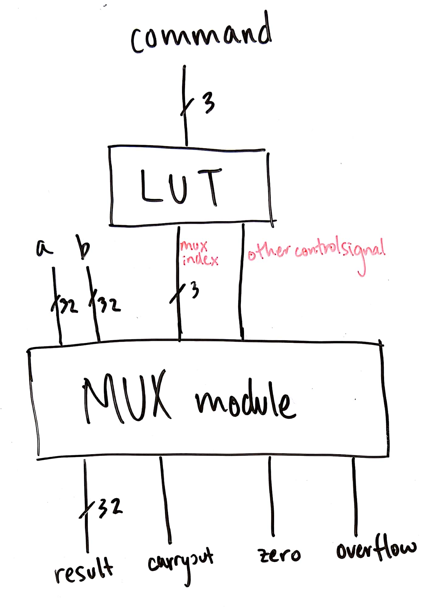
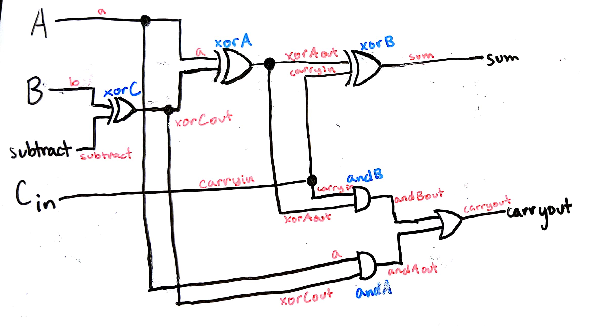
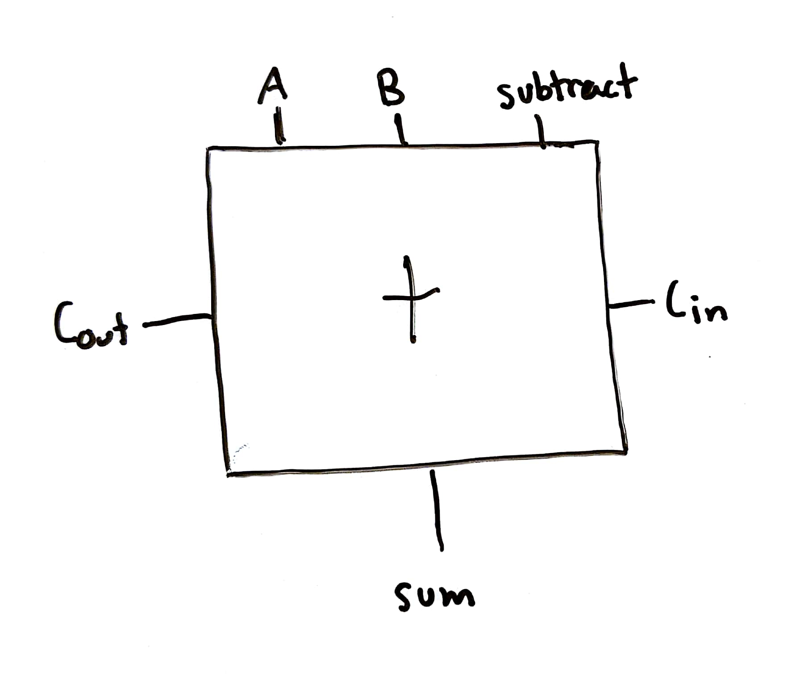
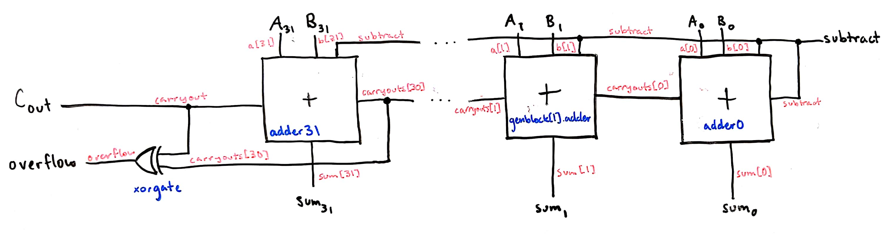
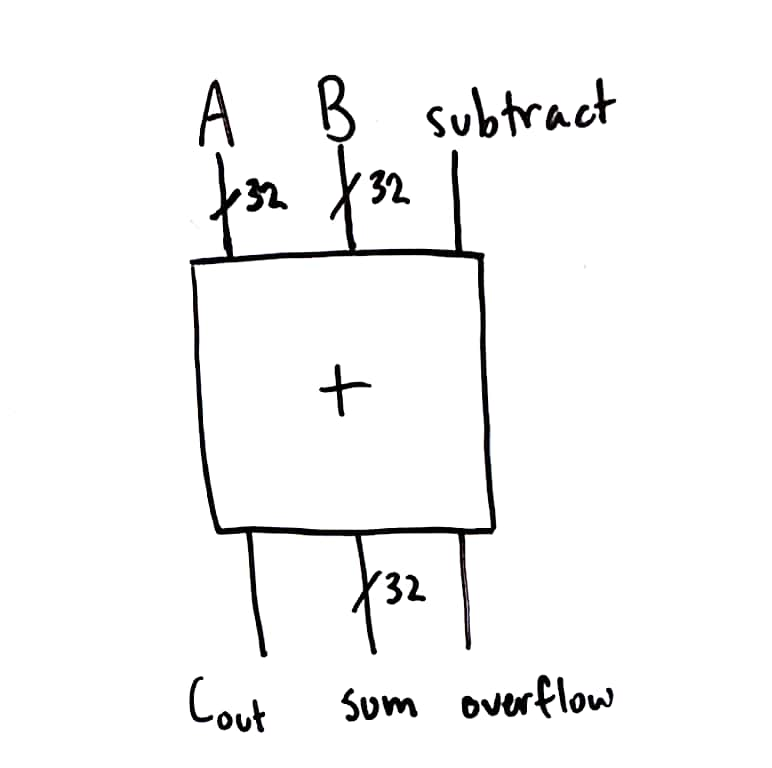
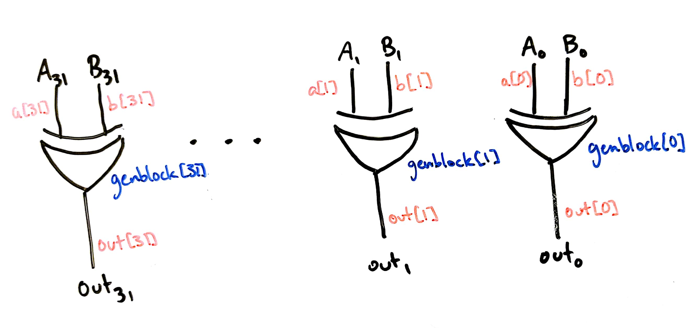
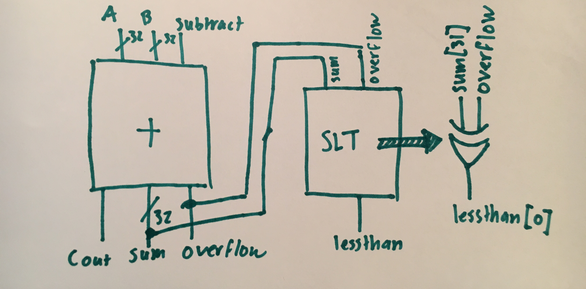
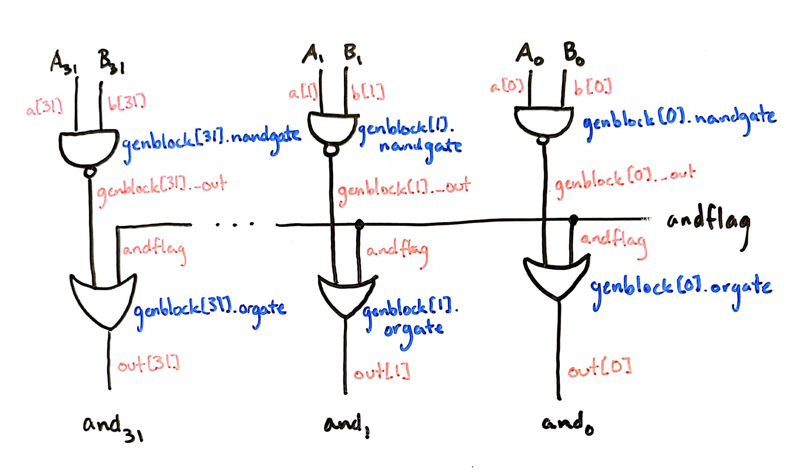
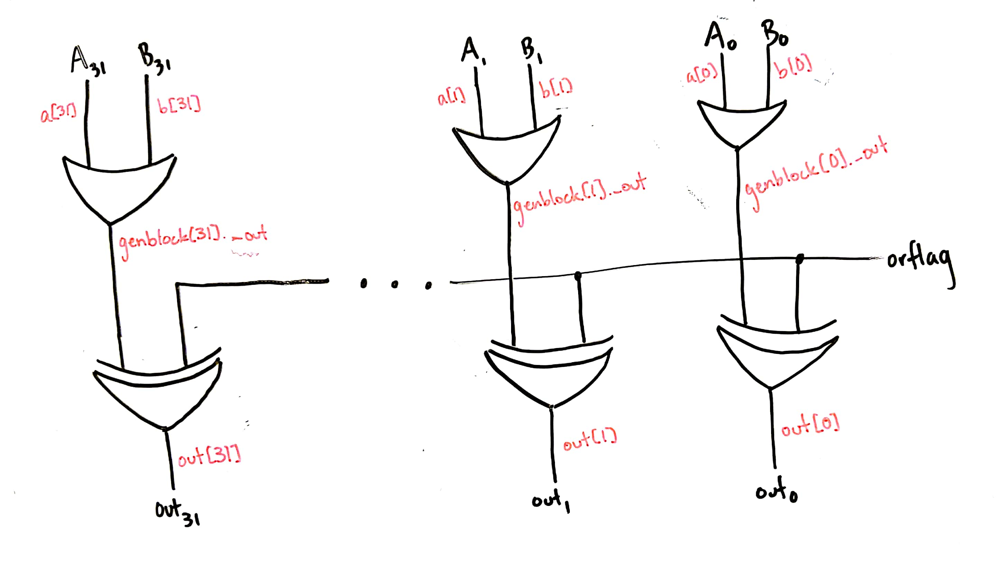

# Nice Try Lab 1: ALU

## Implementation

### Overall architecture plan

We decided to build several 32-bit modules and put them together all at once as a 32-bit ALU. All of our modules are described below. The basic architecture of the entire ALU looks like this:

The lookup table takes in a command and outputs the mux index and another control signal (called `othercontrolsignal`). These both go into the mux module, which then instantiates all of the submodules, creates a mux, and then selects which outputs to use.

### Individual modules

#### Mux

The ALU uses a mux to choose between the results of the other individual modules given the 3 bit mux input. It is actually comprised of 32 individual muxes, one for each of the result bits, and contains 8 and gates that take 4 inputs, the given bit from each of the 8 individual modules, and the 3 selection bits. Some of the selection bits are inverted so that the mux acts like a look-up table for the given individual module. The result from these and gates are then or'd together and output as the result.

#### Add and subtract

The adder was made bitslice, then as a full 32-bit adder. The bitslice adder is similar to our adder from [Lab 0](https://github.com/nielsenlouise/Lab0), except with an additional XOR gate to implement subtraction. Below is a diagram of the bitslice adder, which can be found in [adder.v](adder.v) as the `bitsliceAdder` module. Red labels correspond to wire names and blue labels correspond to gate names (as defined in the Verilog).

In later diagrams, we represent this adder like this:

For the full 32 bit adder, we combined the bitslice adders in a similar way to in [Lab 0](https://github.com/nielsenlouise/Lab0), except we used a generate statement to make the middle adders. Because the 0th adder needs its carryin to be `subtract` and the 31st adder needs its carryout to be `carryout`, those were instantiated separately. Below is a diagram of the full 32 bit adder (which can be found [here](adder.v) as the `full32BitAdder` module), with most of the bitslice adders abstracted out. Red labels correspond to wire names and blue labels correspond to gate names (as defined in the Verilog).

In later diagrams, we will represent the full adder as a black box like this:

#### XOR

Our XOR module is just 32 XOR gates next to each other. It looks like this:

#### Set Less Than

The SLT takes its inputs from the outputs of the adder/subtractor. This works because the adder/subtractor module will be calculating subtraction because the `othercontrolsignal` will be 1 when the ALU command is for the SLT.

Specfically, it looks at the sign bit `sum[31]` and the `overflow` outputs to determine if A < B. If there is no overflow, the LSB of the output `lessthan` will be the same as whatever the sign bit was. If there was overflow, the output should be the opposite of whatever the sign bit was, since with overflow the calculation result will actually have the wrong sign. To get this behavior, `sum[31]` and `overflow` are xor'd together. The rest of the output `lessthan` will be 0's regardless of the result.

 

#### AND and NAND

The AND and NAND full 32 bit module (found [here](and.v) as `full32BitAnd`) takes three things as inputs: A and B, of course, and a flag for whether the desired operation is AND. This flag corresponds to the value of `command[0]`. The diagram is below:

#### OR and NOR

OR and NOR take in A, B, and orflag (which corresponds to `command[0]`). Using an XOR gate allows there to only be two two-input gates per bit for OR and NOR. A diagram is below.

## Testing

### Possibly a description of how all the tests got integrated together

Other things go here too

We didn't calculate the results of our tests ourselves; instead, we checked the output from our implementation against Verilog's math (for example, `if (result !== a&b)` checks if the result of our AND matches `a&b`).

### Addition and subtraction tests

For addition and subtraction with the adder, we tested every possible combination of signs of input, and carryout and overflow values. These test benches did not result in any changes in our implementation.

Below are tables containing the tests for addition and subtraction. The "Case" column is sign of input a, sign of input b, value of carryout, and value of overflow (for example, +-01 means a is positive, b is negative, carryout is 0, and overflow is 1).

Addition:

| Case | A | B | Sum | Carryout | Overflow |
|---|---|---|---|---|---|
| ++00 | 00000000000000000111010100110000 | 00000000000000000111010100110000 | 00000000000000001110101001100000 | 0 | 0 |
| +-00 | 00000000000000001110101001100000 | 11111111111111110001010110011011 | 11111111111111111111111111111011 | 0 | 0 |
| +-10 | 01111111111111111111111111111111 | 10000000000000000000000000000001 | 00000000000000000000000000000000 | 1 | 0 |
| -+00 | 11111111111111111110011000111000 | 00000000000000000001001110001000 | 11111111111111111111100111000000 | 0 | 0 |
| -+10 | 11111111111111111111111111011100 | 01000000000000000000000000000000 | 00111111111111111111111111011100 | 1 | 0 |
| --10 | 11111111111111111111110101110110 | 11111111111111111110110001110111 | 11111111111111111110100111101101 | 1 | 0 |
| ++01 | 01111111111111111111111111111111 | 00000000000000000000000000000001 | 10000000000000000000000000000000 | 0 | 1 |
| --11 | 10100110100101111101000100000000 | 10001000110010100110110000000000 | 00101111011000100011110100000000 | 1 | 1 |

Subtraction:

| Case | A | B | Difference | Carryout | Overflow |
|---|---|---|---|---|---|
| ++00 | 00000000000000000000000000110111 | 00000000000000000000000000111100 | 11111111111111111111111111111011 | 0 | 0 |
| ++10 | 01111111111111111111111111111111 | 00000000000000000000000000111100 | 01111111111111111111111111000011 | 1 | 0 |
| +-00 | 00000000010110111000110110000000 | 11111111111111111111001001010100 | 00000000010110111001101100101100 | 0 | 0 |
| -+10 | 11111111111111111001101001110000 | 00000000000001101110000000110100 | 11111111111110001011101000111100 | 1 | 0 |
| --00 | 10000000000000000000000000000001 | 11111111111111111111111111100110 | 10000000000000000000000000011011 | 0 | 0 |
| --10 | 11111111111111111111111111011100 | 11111111111111111111111111011100 | 00000000000000000000000000000000 | 1 | 0 |
| +-01 | 01011001011010000010111100000000 | 10100110100101111101000100000000 | 10110010110100000101111000000000 | 0 | 1 |
| -+11 | 10000010110101001000101100000000 | 01000000000000000000000000000000 | 01000010110101001000101100000000 | 1 | 1 |

### XOR tests

It was difficult to come up with test cases for the basic gates. For all of them (XOR, AND/NAND, and OR/NOR), we used the same two pairs of inputs. We didn't discover any problems in our implementation from the test bench.

| A | B | XOR |
|---|---|---|
| 11111111111111111111111111111110 | 11000000110100011111111000001110 | 00111111001011100000000111110000 |
| 00000101111101100101001111001000 | 00001110000000011010000000001110 | 00001011111101111111001111000110 |

### Set less than tests

For Set Less Than, there are two options for A and B, positive or negative, and the outcome can be true or false for the different combinations, so we have a test case for each combination. Additionally, there are the case where A=B (one for positive and one for negative). Finally, for the cases where the subtraction had an overflow, the SLT needs to return the opposite of the sign bit of the sum, so we have test cases where A was positive and B was negative and there was overflow, and A was negative and B was positive and there was overflow. These different cases capture all the possible behaviors. In the table they are expressed in decimal, but they are 32-bit binary inputs when given to the SLT module.

| Case | A | B | Expected | Actual |
|---|---|---|---|---|
| ++ | 2 | 4 | 1 | 1 |
| ++ | 8 | 1 | 0 | 0 |
| -- | -4 | -2 | 1 | 1|
| -- | -1 | -5 | 0 | 0 |
| +- | 2 | -5 | 0 | 0|
| -+ | -4 | 100 | 1 | 1 |

Same Number

| Case | A | B | Expected | Actual |
|---|---|---|---|---|
| ++ | 2 | 2 | 0 | 0 |
| -- | -4 | -4 | 0 | 0 |

Cases with Overflow

| Case | A | B | Expected | Actual |
|---|---|---|---|---|
| +- | 2147483646 | -2 | 0 | 0 |
| -+ | -2147483648 | 3 | 1 | 1 |

#### Problems Detected by SLT Test Bench

Originally, overflow test cases were missing and the SLT seemed to be working when it wasn't. Once we added the overflow test cases, we found that our original model of just taking the sign bit of the sum from subtracting A-B was incorrect. Our original overflow test cases were not actually going to produce overflows for the 32-bit version since we was originally using the overflow numbers for a 4-bit SLT or 4-bit adder subtracter.

### AND and NAND tests

We used the pairs of inputs also used for the XOR module, but this time for both the AND and NAND tests.

In our first iteration of the AND/NAND module, we used an XOR gate instead of an XNOR gate, which assumes that `andflag` will be true when AND is the desired operation. When we started working on integrating our modules into an ALU, we realized that, for all of the two-operation modules, `command[0]` could work as a flag, and that we should produce AND when `command[0]` is false, and NAND when it is true. This happens when you XNOR the output of NANDing the inputs with `command[0]`.

| A | B | AND | NAND |
|---|---|---|---|
| 11111111111111111111111111111110 | 11000000110100011111111000001110 | 11000000110100011111111000001110 | 00111111001011100000000111110001 |
| 00000101111101100101001111001000 | 00001110000000011010000000001110 | 00000100000000000000000000001000 | 11111011111111111111111111110111 |

### OR and NOR tests

We tested OR/NOR on the same values we tested AND/NAND. Using our testbench didn't discover any problems in our OR/NOR implementation. Here's a table of the same test cases as above, with the NOR and OR values.

| A | B | NOR | OR |
|---|---|---|---|
| 11111111111111111111111111111110 | 11000000110100011111111000001110 | 00000000000000000000000000000001 | 11111111111111111111111111111110 |
| 00000101111101100101001111001000 | 00001110000000011010000000001110 | 11110000000010000000110000110001 | 00001111111101111111001111001110 |

### ALU Tests
We used some select test cases from our adder test cases since they would capture the special cases that adder has as well as the special cases for the SLT module. Our cases capture a few different combinations of positive and negative numbers, some with carryout some without, and a case with overflow. The second case in the table should also overflow for the SLT operation, testing that edge case. The other simple modules that are just gates don't really have edge cases that we needed to check. For each test case, the test bench ran the A and B inputs through all 8 operations and checked for the expected results. More in depth reasoning and explanations for the special cases can be found in the sections for the Adder/Subtracter module and the SLT module.  

| Case | Cout | Over | A | B |
|---|---|---|---|---|
| ++ | 0 | 0 | 30000 | 30000 |
| +- | 1 | 0 | 2147483647 | -2147483647 |
| -- | 1 | 0 | -650 | -5001 |
| -+ | 1 | 0 | -36 | 1073741824 |
| -- | 1 | 1 | -1500000000 | -1500000000 |
| ++ | 0 | 1 | 2147483647 | 1 |

## Timing analysis

## Work plan reflection

The only activity that took less time than we anticipated was coming up with general test cases which we did on our Sunday meeting. Instead of spending an hour we only spent 15 minutes since we didn't go into detail for each individual case. Everything else took much longer. Even though we aimed to have our individual module test benches done by Wednesday, none of them were done by our Wednesday meeting. During our meeting we had planned to implement the ALU and figure out the control logic LUT, but we did not accomplish those during the meeting because we spent our time debugging our modules and working on their test benches. We met for 4 hours on Wednesday, which was much longer than our planned 2 hours. Finally on Thursday, we made all of our test benches, did the ALU implementation, and wrote the rest of the report. Overall it took us ~4 hours each individually working on the lab, plus some time spent together (~1hr) for around 12hrs total on Thursday night.

Overall implementation and writing test benches took much longer than expected, so in the future we would want to work on these sooner and be able to go to more NINJA and Office hours earlier in the week to get those problems sorted in a timely manner. Since we were all confused about the ALU, we somewhat pushed it off as a future problem to worry about since we planned to figure it out on Wednesday, but in the future we should work on the most challenging aspect of the lab first. This would allow us to have more time to think about the problem and reach out to the teaching team for more guidance.
