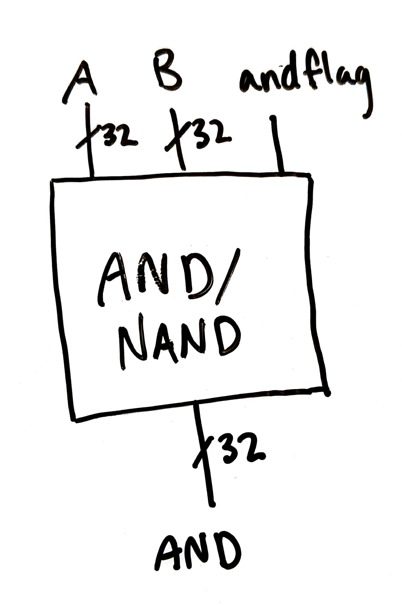

# Nice Try Lab 1

## Implementation

### Overall architecture plan

### Individual modules

#### Add and subtract

The adder was made bitslice, then as a full 32-bit adder. The bitslice adder is similar to our adder from [Lab 0](https://github.com/nielsenlouise/Lab0), except with an additional XOR gate to implement subtraction. Below is a diagram of the bitslice adder, which can be found in [adder.v](adder.v) as the `bitsliceAdder` module. Red labels correspond to wire names and blue labels correspond to gate names (as defined in the Verilog).

In later diagrams, we represent this adder like this:

For the full 32 bit adder, we combined the bitslice adders in a similar way to in [Lab 0](https://github.com/nielsenlouise/Lab0), except we used a generate statement to make the middle adders. Because the 0th adder needs its carryin to be `subtract` and the 31st adder needs its carryout to be `carryout`, those were instantiated separately. Below is a diagram of the full 32 bit adder (which can be found [here](adder.v) as the `full32BitAdder` module), with most of the bitslice adders abstracted out. Red labels correspond to wire names and blue labels correspond to gate names (as defined in the Verilog).

In later diagrams, we will represent the full adder as a black box like this:

#### AND and NAND

The AND and NAND full 32 bit module (found [here](and.v) as `full32BitAnd`) takes three things as inputs: A and B, of course, and a flag for whether the desired operation is AND. The diagram is below:

In our first iteration of the AND/NAND module, we used an XOR gate instead of an XNOR gate, which assumes that `andflag` will be true when AND is the desired operation. When we started working on integrating our modules into an ALU, we realized that, for all of the two-operation modules, `command[0]` could work as a flag, and that we should produce AND when `command[0]` is false, and NAND when it is true. This happens when you XNOR the output of NANDing the inputs with `command[0]`.

Additionally, we were unsure how best to approximate the timing of XNOR. We decided to make it cost 3 units of time - cheaper than implementing XNOR with other gates, but more expensive than just accounting for the two inputs.

In future diagrams, we'll probably represent it like this:

#### Other components go here

## Testing

### Possibly a description of how all the tests got integrated together

Other things go here too

We didn't calculate the results of our tests ourselves; instead, we checked the output from our implementation against Verilog's math (for example, `if (result !== a&b)` checks if the result of our AND matches `a&b`).

### Addition and subtraction tests

### XOR tests

### Set less than tests

For Set Less Than, there are two options for A and B, positive or negative, and the outcome can be true or false for the different combinations, so we have a test case for each combination. Additionally, there are the case where A=B (one for positive and one for negative). Finally, for the cases where the subtraction had an overflow, the SLT needs to return the opposite of the sign bit of the sum, so we have test cases where A was positive and B was negative and there was overflow, and A was negative and B was positive and there was overflow. These different cases capture all the possible behaviors. In the table they are expressed in decimal, but they are 32-bit binary inputs when given to the SLT module.

| Case | A | B | Expected | Actual |
|---|---|---|---|---|
| ++ | 2 | 4 | 1 | 1 |
| ++ | 8 | 1 | 0 | 0 |
| -- | -4 | -2 | 1 | 1|
| -- | -1 | -5 | 0 | 0 |
| +- | 2 | -5 | 0 | 0|
| -+ | -4 | 100 | 1 | 1 |

Same Number

| Case | A | B | Expected | Actual |
|---|---|---|---|---|
| ++ | 2 | 2 | 0 | 0 |
| -- | -4 | -4 | 0 | 0 |

Cases with Overflow

| Case | A | B | Expected | Actual |
|---|---|---|---|---|
| +- | 2147483646 | -2 | 0 | 0 |
| -+ | -2147483648 | 3 | 1 | 1 |

#### Problems Detected by SLT Test Bench

Originally, overflow test cases were missing and the SLT seemed to be working when it wasn't. Once we added the overflow test cases, we found that our original model of just taking the sign bit of the sum from subtracting A-B was incorrect. Our original overflow test cases were not actually going to produce overflows for the 32-bit version since we was originally using the overflow numbers for a 4-bit SLT or 4-bit adder subtracter. 

### AND and NAND tests

It was difficult to come up with test cases for the basic gates. For AND and NAND, we tested just two pairs of numbers, and used those pairs for both tests.

| A | B | AND | NAND |
|---|---|---|---|
| 11111111111111111111111111111110 | 11000000110100011111111000001110 | 11000000110100011111111000001110 | 00111111001011100000000111110001 |
| 00000101111101100101001111001000 | 00001110000000011010000000001110 | 00000100000000000000000000001000 | 11111011111111111111111111110111 |

### OR and NOR tests

## Timing analysis

## Work plan reflection
