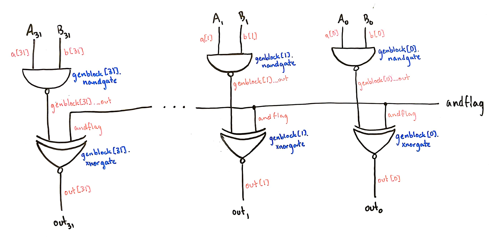

# Nice Try Lab 1

## Implementation

### Overall architecture plan

### Individual modules

#### Add and subtract

The adder was made bitslice, then as a full 32-bit adder. The bitslice adder is similar to our adder from [Lab 0](https://github.com/nielsenlouise/Lab0), except with an additional XOR gate to implement subtraction. Below is a diagram of the bitslice adder, which can be found in [adder.v](adder.v) as the `bitsliceAdder` module. Red labels correspond to wire names and blue labels correspond to gate names (as defined in the Verilog).

In later diagrams, we represent this adder like this:

For the full 32 bit adder, we combined the bitslice adders in a similar way to in [Lab 0](https://github.com/nielsenlouise/Lab0), except we used a generate statement to make the middle adders. Because the 0th adder needs its carryin to be `subtract` and the 31st adder needs its carryout to be `carryout`, those were instantiated separately. Below is a diagram of the full 32 bit adder (which can be found [here](adder.v) as the `full32BitAdder` module), with most of the bitslice adders abstracted out. Red labels correspond to wire names and blue labels correspond to gate names (as defined in the Verilog).

In later diagrams, we will represent the full adder as a black box like this:

#### AND and NAND

The AND and NAND full 32 bit module (found [here](and.v) as `full32BitAnd`) takes three things as inputs: A and B, of course, and a flag for whether the desired operation is AND. The diagram is below:

In future diagrams, we'll probably represent it like this:

#### Other components go here

## Testing

## Timing analysis

## Work plan reflection
